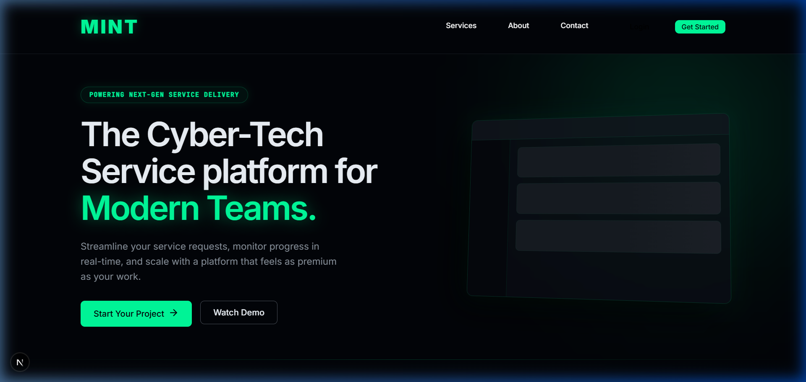
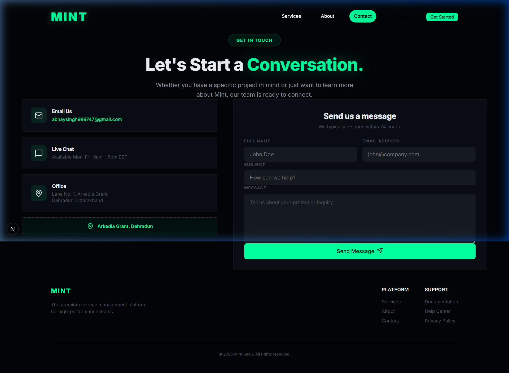
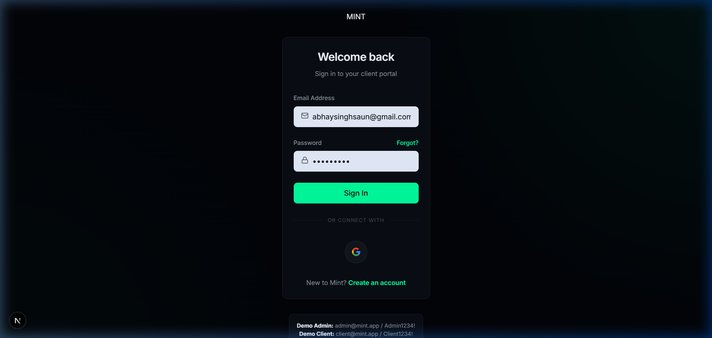

<div align="center">
  <h1>Mint — Modern Service Platform</h1>
  <p>A premium, full-stack SaaS platform built with Next.js for high-performance teams.</p>
</div>



## Overview
Mint is a premium, full-stack Service-as-a-Software (SaaS) platform designed for high-performance teams to manage client requests effortlessly. It provides a flawlessly engineered, ultra-modern portal where clients can submit project requests, and administrators can track, assign, and resolve them in real-time. Built with an intense focus on aesthetic UI/UX, Mint features striking dark-mode aesthetics, glassmorphic layouts, and fluid micro-animations.

## 🚀 Core Features
*   **Dual-Role Dashboard Architecture**: Separate, intensely optimized workflows for `CLIENT` and `ADMIN` users.
*   **Real-Time Request Tracking**: A comprehensive ticketing system handling statuses (Pending, Active, Completed) complete with Priority management. 
*   **Integrated Messaging System**: Direct communication threads embedded inside every project request. 
*   **State-of-the-Art Authentication**: Hybrid authentication bridging standard credential logins with frictionless Google OAuth (Firebase).
*   **Fluid Visuals**: Custom-built using Next.js featuring zero-reload SPA navigation and interactive fluid animations.

## 📸 Screenshots

| Contact Page | Login Flow |
| :---: | :---: |
|  |  |

## 🛠️ Tech Stack & Enterprise Architecture
*   **Frontend:** Next.js (App Router), React 18, Custom Vanilla CSS, Lucide Icons
*   **Backend:** Next.js Server Actions & API Routes, Prisma ORM, JWT
*   **Databases:**
    *   **PostgreSQL via Neon DB**: Handles all primary relational data.
    *   **Upstash Redis**: Runs hyper-fast caching and background job queuing.
*   **Integrations:** Firebase (OAuth), Resend (Emails), FormSubmit (Direct Contact Forms)

## 💻 Getting Started

### Prerequisites
Make sure you have Node.js and npm installed.

### Installation

1. **Clone the repository**
   ```bash
   git clone https://github.com/yourusername/mint.git
   cd mint
   ```

2. **Install dependencies**
   ```bash
   npm install
   ```

3. **Set up environment variables**
   Copy the `.env.example` file to create your local `.env`:
   ```bash
   cp .env.example .env
   ```
   Fill in your actual DB strings from Neon, Upstash, and Firebase.

4. **Initialize the Database**
   ```bash
   npx prisma generate
   npx prisma db push
   ```

5. **Start the Development Server**
   ```bash
   npm run dev
   ```
   Your app will be running securely on [http://localhost:3000](http://localhost:3000).

---

*Note: The images above link to local placeholders. Before pushing to your public GitHub profile, replace the files inside `public/docs/images/` with actual screenshots of your running app!*
